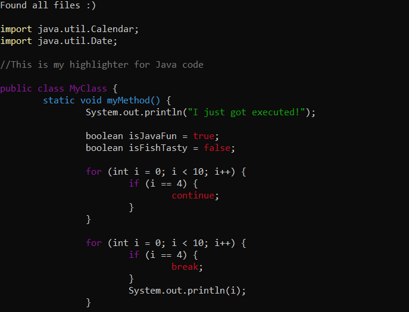

# Assignment 5 - How to run and use the scripts

## Programs and versions
* Python 3.7.3
* Ubuntu 18.04.2 LTS

## 5.1  Syntax highlighting (7 points)
You can run the the program with:
```
$ python3 highlighter.py naython.syntax naython.theme hello.ny
```


## 5.2 Python syntax (5 points + 5 bonus points)
Color themes:
* python.theme
* python2.theme

You can run the the program with:
```
$ python3 highlighter.py [python.syntax, python2.syntax] python2.theme python_demo.py
```
Python example (python.theme)|  Python example 2 (python2.theme)
:-------------------------:|:-------------------------:
 | 


## 5.3 Syntax for your favorite language (Up to 5 bonus points)
Color themes:
* java.theme
* java2.theme

You can run the the program with:
```
$ python3 highlighter.py java.syntax java.theme java_demo.java
```
Java example (java.theme)|  Java example 2 (java2.theme)
:-------------------------:|:-------------------------:
 | 

## 5.4 grep (5 points + 5 bonus points)
Flags:
* --highlighter

You can run the the program with:
```
$ python3 grep.py grep.syntax grep_demo.txt [--highlighter]
```
grep example |  grep example + highlighter flag
:-------------------------:|:-------------------------:
 | 

## 5.5 superdiff (10 points)
You can run the the program with:
```
$ python3 diff.py diff1.txt diff2.txt
```
To use the code under (5.6) you need to pipe the output into a file. 
```
$ python3 diff.py diff1.txt diff2.txt > diff_output.txt
```
Diff example\

## 5.6 Coloring diff (3 points)
You can run the the program with:
```
$ python3 highlighter.py diff.syntax diff.theme diff_output.txt
```

Diff Highlighter Example\


