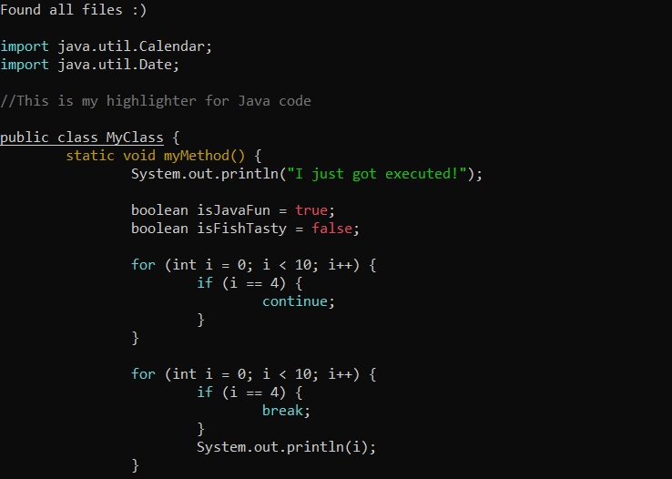

# Assignment 5 - How to run and use the scripts

## Programs and versions
* Python 3.7.3
* Ubuntu 18.04.2 LTS

## 5.1  Syntax highlighting (7 points)
You can run this program with:
```
$ python3 highlighter.py naython.syntax naython.theme hello.ny
```


## 5.2 Python syntax (5 points + 5 bonus points)
Color themes:
* python.theme
* python2.theme

You can run this program with:
```
$ python3 highlighter.py [python.syntax, python2.syntax] python2.theme python_demo.py
```
Python example (python.theme)|  Python example 2 (python2.theme)
:-------------------------:|:-------------------------:
 | 


## 5.3 Syntax for your favorite language (Up to 5 bonus points)
<sub>I really dont have a favorite language...But Java was an example in the assignement, and its the language I have the most experience with after Python. So it seemed natural for me to choose Java.<sub>
 
Color themes:
* java.theme
* java2.theme

You can run this program with:
```
$ python3 highlighter.py java.syntax java.theme java_demo.java
```
Java example (java.theme)|  Java example 2 (java2.theme)
:-------------------------:|:-------------------------:
 | 

## 5.4 grep (5 points + 5 bonus points)
<sub>My program will print a line twice if 2 regex expressions are match on that line. I didnt find any spesification around it in the assignement text. So i didnt choose to do anything about it.<sub>

Flags:
* --highlighter

You can run this program with:
```
$ python3 grep.py grep.syntax grep_demo.txt [--highlighter]
```
grep example |  grep example + highlighter flag
:-------------------------:|:-------------------------:
 | 

## 5.5 superdiff (10 points)
You can run this program with:
```
$ python3 diff.py diff1.txt diff2.txt
```
To use the code under (5.6) you need to pipe the output into a file. 
```
$ python3 diff.py diff1.txt diff2.txt > diff_output.txt
```
Diff example\

## 5.6 Coloring diff (3 points)
You can run the the program with:
```
$ python3 highlighter.py diff.syntax diff.theme diff_output.txt
```

Diff Highlighter Example\


## Regex expressions
I have used the same essential regex functions i both Python and Java syntax. I will therefor only use regex expressions from Python.syntax as example. Many of my expressions use the same references in the functions aswell. I therefor have handpicked a few functions to explain.

If you want a better explanation I recommend using this site: https://regex101.com/


### Function
```
Regex function: (\bdef\b(?=(?:\s\w*\(\w*\)):))
```
* 1st Capturing Group ```(\bdef\b(?=(?:\s\w*\(\w*\)):))```
  * \b assert position at a word boundary: ```(^\w|\w$|\W\w|\w\W)```
  * def matches the characters def literally (case sensitive)
  * Positive Lookahead ```(?=(?:\s\w*\(\w*\)):)```
    * Non-capturing group ```(?:\s\w*\(\w*\))```
    * \s matches any whitespace character (equal to [\r\n\t\f\v ])
    * \w* matches any word character (equal to [a-zA-Z0-9_])
    * \( and \) and : matches the character (, ) and : literally (case sensitive)
### Strings
```
Regex function: ([\'\"]{3}(?:\n|.)*?[\'\"]{3}|\'.*?\'|\".*?\")
```
* 1st Capturing Group ```([\'\"]{3}(?:\n|.)*?[\'\"]{3}|\'.*?\'|\".*?\")```
  * 1st Alternative ```[\'\"]{3}(?:\n|.)*?[\'\"]{3}```
    * Match a single character present in the list below ```[\'\"]{3}```
      * {3} Quantifier — Matches exactly 3 times
      * \' or \" matches the character ' or " literally (case sensitive)
    * Non-capturing group ```(?:\n|.)*?```
      * *? Quantifier — Matches between zero and unlimited times, as few times as possible, expanding             as needed (lazy)
        * 1st Alternative \n
          * \n matches a line-feed (newline) character (ASCII 10)
        * 2nd Alternative .
          * . matches any character (except for line terminators)
  * 2nd and 3nd Alternative \'.*?\' and \".*?\"
    * \' or \" matches the character ' or " literally (case sensitive)
    * .*? matches any character (except for line terminators)
      * *? Quantifier — Matches between zero and unlimited times, as few times as possible, expanding   as needed (lazy)
    * \' or \" matches the character ' or " literally (case sensitive)
    
### While-loops
```
Regex function: (\bwhile\b(?=\s?(?:\w+\s*|\w+\s*(?:==|!=|<>|>|<|>=|<=)\s*\w+)?(?::)))
```
* 1st Capturing Group ```(\bwhile\b(?=\s?(?:\w+\s*|\w+\s*(?:==|!=|<>|>|<|>=|<=)\s*\w+)?(?::)))```
  * \b assert position at a word boundary: (^\w|\w$|\W\w|\w\W)
  * while matches the characters while literally (case sensitive)
  * Positive Lookahead ```(?=\s?(?:\w+\s*|\w+\s*(?:==|!=|<>|>|<|>=|<=)\s*\w+)?(?::))```
    * \s? matches any whitespace character (equal to [\r\n\t\f\v ])
    * ? Quantifier — Matches between zero and one times, as many times as possible, giving back as needed (greedy)
    * Non-capturing group ```(?:\w+\s*|\w+\s*(?:==|!=|<>|>|<|>=|<=)\s*\w+)?```
      * 1st Alternative ```\w+\s*```
        * \w+ matches any word character (equal to [a-zA-Z0-9_])
        * \s* matches any whitespace character (equal to [\r\n\t\f\v ])
      * 2nd Alternative ```\w+\s*(?:==|!=|<>|>|<|>=|<=)\s*\w+```
        * \w+ matches any word character (equal to [a-zA-Z0-9_])
        * \s* matches any whitespace character (equal to [\r\n\t\f\v ])
          * Non-capturing group ```(?:==|!=|<>|>|<|>=|<=)```
            * 1st Alternative ==
            * 2nd Alternative !=
            * ...
    * Non-capturing group ```(?::)```
      * : matches the character : literally (case sensitive)
